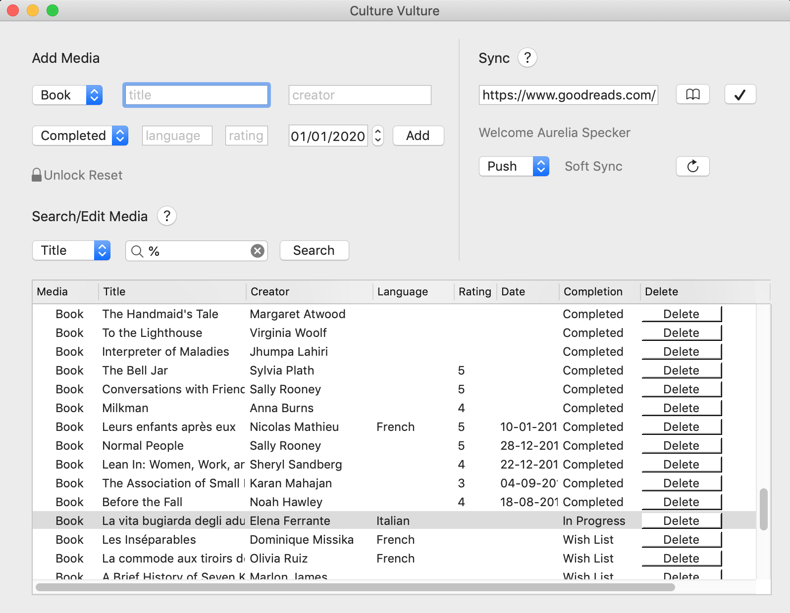

# Culture Vulture
Culture Vulture is a Mac OS X app to log your favourite media.
Media records are stored locally and books can also be synced with Goodreads.




## Setup

### Syncing

Add developer keys to the ```GoodreadsHandler.cs``` class:
```cs
 public GoodreadsHandler()
        {
            //Construct loading developer keys

            //##### Developer keys and secret here #####
            DeveloperKey = "XXXXXX"; 
            DeveloperSecret = "XXXXXX"; 
            Client.Authenticator = OAuth1Authenticator.ForRequestToken(DeveloperKey, DeveloperSecret);
        }
```

## Usage

To come!